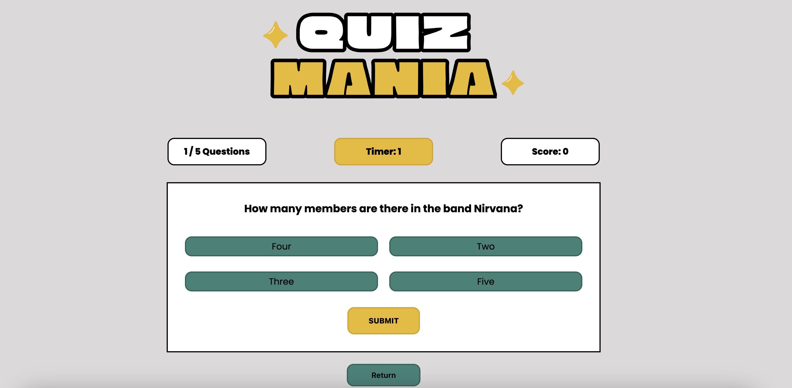

# Quiz Mania

Are you ready to put your trivia knowledge to the test in a race against the clock? ...No? Too bad - this is Quiz Mania, it's what we do here, buddy. With each correct answer, you'll get a point! Run out of time, or answer incorrectly, and you will not receive a point. See how many points you can collect before the quiz is over!

## Overview

This project is a simple quiz application built using vanilla JavaScript, CSS, and HTML. It utilizes the Open Trivia Database API ([https://opentdb.com/](https://opentdb.com/)) to fetch trivia questions in various categories.

## Features

- Fetch trivia questions from the Open Trivia Database API.
- Display trivia questions with multiple-choice answers.
- Start a countdown timer for each question.
- Allow users to select an answer within the time limit.
- Display correct/incorrect feedback after each question.
- Keep track of the user's score.

## Screenshot

